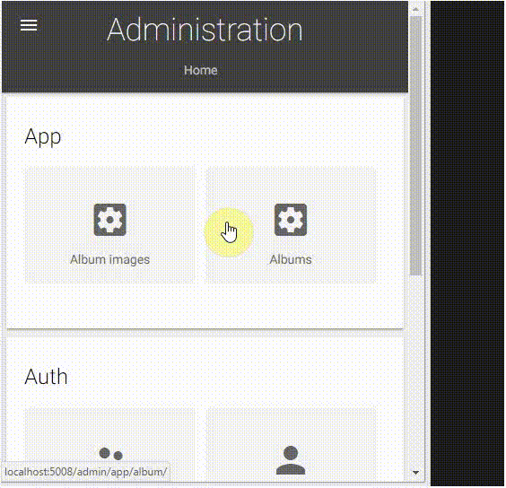

# Django Photo Gallery Sample #


## Summary

This sample contains a Django 2.x Image Gallery Site. The album images are optimized for performance. The Django Photo Gallery Sample is responsive and mobile/device friendly.


### Create an album from the Django admin panel

Albums can be created from the Django admin panel where one zip file with all the images should be selected from the PC. The Django Photo Gallery will resize the images to improve the picute load times and will also create thumbnail for every image in the zip.




## Tested with Django / Python


## Additional Django apps dependencies
- Pillow
- django-imagekit
- django_compressor

## Additional JavaScript apps dependencies
- photoswipe

## Prerequisites

- Django-Python [development environment](https://www.djangoproject.com/start/) already set up.
- virtualenv installed.

## Solution

Solution|Author(s)
--------|---------
Django Photo Gallery | Velin Georgiev ([@VelinGeorgiev](https://twitter.com/velingeorgiev))

## Version history

Version|Date|Comments
-------|----|--------
0.0.1|April 30, 2017 | Initial commit
0.0.2|April 06, 2018 | Updated to python 3.6 and Django 2.0.4
0.0.3|April 07, 2018 | django-material replaced with milligram
0.0.4|April 08, 2018 | seo and compression optimizations

## Disclaimer
**THIS CODE IS PROVIDED *AS IS* WITHOUT WARRANTY OF ANY KIND, EITHER EXPRESS OR IMPLIED, INCLUDING ANY IMPLIED WARRANTIES OF FITNESS FOR A PARTICULAR PURPOSE, MERCHANTABILITY, OR NON-INFRINGEMENT.**

---

## Minimal Path to Awesome

- Clone this repository.
- Open the command line, navigate to the django app folder and execute:
    - `virtualenv env` (requires virtualenv)
    - Linux: `source env/bin/activate`, Windows: `call env/Scripts/activate.bat`
    - `pip install -r requirements.txt`
    - If the Pillow fail to install on Windows, then install it manually `pip install ../whl/Pillow-5.0.0-cp27-none-win32.whl` (if you are not using python 2.7 32 bit then  [download the Pillow wheel](http://www.lfd.uci.edu/~gohlke/pythonlibs/#pillow) for your python version).
    - `python manage.py runserver`
    - Open http://127.0.0.1:8000/ in web browser.
    - To access the admin forms go to http://127.0.0.1:8000/admin/ and enter user: admin, password: administrator

## Features

This Sample illustrates the following concepts on top of the Django Framework:

- Using milligram for building Django any device ready UI.
- Using django-imagekit for building resizing images.
- Using photoswipe javascript library for more rich image gallery user experience.

## Control the image size and quality
The picture size and quality can be controlled programatically from the models.py. Just change the processors. For more information see [django-imagekit](https://github.com/matthewwithanm/django-imagekit).

```python
class AlbumImage(models.Model):
    image = ProcessedImageField(upload_to='albums', processors=[ResizeToFit(1280)], format='JPEG', options={'quality': 70})
    thumb = ProcessedImageField(upload_to='albums', processors=[ResizeToFit(300)], format='JPEG', options={'quality': 80})
    ...
```

## Sample data cleanup
To cleanup the sample data delete the sql lite database and the media folder files. Create new database and run the sample again.

## No validation on the form
This is sample. I decided to keep it simple and let the validation to be added by you.

## Useful links
- Card css https://codepen.io/mcraiganthony/pen/NxGxqm
- Some more nice cards css https://codepen.io/szpakoli/pen/xbJjdR, https://codepen.io/nodws/pen/ZpZjpQ
- Even more cards css http://freefrontend.com/css-cards/

## Contributions are welcome

Feel free to submit a pull request to improve the program. Please note, this sample is meant to be fast so pull requests that might impact load times will have to be refactored.

## Sharing is Caring

Star if you like it :)
